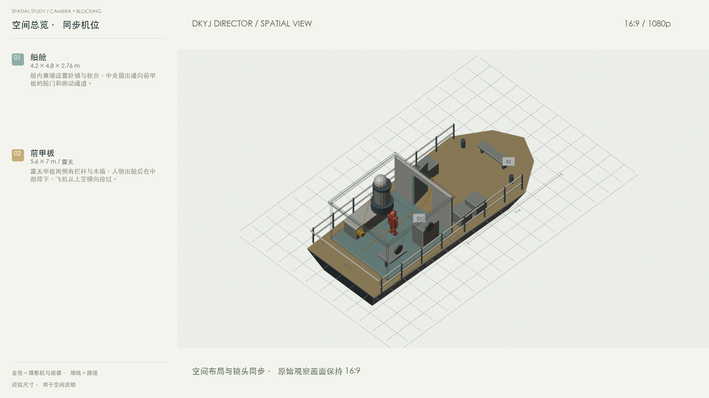

# DKYJ Director

**大开眼界导演台 · Local Blender camera previs**

English · [简体中文](README.zh-CN.md)

Build a simple scene with your own MCP-capable agent, rehearse editable action in Blender, then operate and record a virtual camera from a desktop or iPhone browser. Preview the shot alongside a synchronized spatial view.

## Download · 0.8.0-preview.3

The repository name and link stay the same. This is the official download and documentation hub; the complete application source is inside each installation ZIP.

| Platform | Installation bundle | Checksum | Desktop browser |
| --- | --- | --- | --- |
| macOS | [Download ZIP](https://raw.githubusercontent.com/wangjiake666/dkyj-director/main/downloads/dkyj-director-0.8.0-preview.3-macos.zip) | [SHA-256](https://raw.githubusercontent.com/wangjiake666/dkyj-director/main/downloads/dkyj-director-0.8.0-preview.3-macos.sha256) | Safari |
| Windows 11 x64 | [Download ZIP](https://raw.githubusercontent.com/wangjiake666/dkyj-director/main/downloads/dkyj-director-0.8.0-preview.3-windows.zip) | [SHA-256](https://raw.githubusercontent.com/wangjiake666/dkyj-director/main/downloads/dkyj-director-0.8.0-preview.3-windows.sha256) | Edge |

**Phone: iPhone Safari only.** These are source-and-launcher bundles, not standalone EXE/DMG apps. Install [Blender](https://www.blender.org/download/) and [Python 3.11+](https://www.python.org/downloads/) separately. **Code → Download ZIP downloads the guide and nested installation ZIPs; extract the platform ZIP in `downloads/` before setup.** GitHub Pages cannot run the Blender backend.

[English installation and usage](INSTALL.md) · [中文安装与使用](INSTALL.zh-CN.md) · [Release notes](docs/release-notes.md)

1. Extract the ZIP for your computer. On Mac, open **Launch DKYJ Director.command**. On Windows, run **Install DKYJ Director.cmd**, then **Launch DKYJ Director.cmd**.
2. Open the welcome screen. Select a built-in example or describe your space, characters, action and camera intent. For AI editing, follow the [Blender MCP + DKYJ MCP guide](docs/agent-setup.md) and ask your agent to execute the task.
3. On the desktop, click **连接 iPhone · 扫码运镜**. Join the same Wi-Fi and open the pairing link in iPhone Safari. Phone orientation needs the documented HTTPS certificate and motion-permission setup.
4. Rehearse, record and export. Camera and overhead views are each 16:9; export separately or as a stacked video with two 16:9 panels.

## Lite / Pro · one installation

| Feature | Lite | Pro |
| --- | --- | --- |
| Saved scenes per project | 3; manually delete an old scene to save an extra draft | Unlimited |
| Touch, phone orientation and keyboard recording | Available | Available |
| Xbox / PS5 camera preview, elevation, pitch and zoom | Available | Available |
| Gamepad recording in your projects | Independent built-in trial only | Available |
| Video and reference exports | Preview watermark | No watermark |

Valid author-issued v1 codes activate Pro offline without reinstalling. **The Afdian purchase link and automatic paid delivery are not ready.** This release is a software preview. Ordinary sponsorship does not automatically issue a Pro code. [License and activation guide](docs/licensing.md)

## Examples and references

[Room + Steamship example videos](samples/README.md) · [Controller mapping](docs/gamepad.md) · [Export formats](docs/export-formats.md) · [Seedance official references](docs/seedance-2.5-reference.md)

The installation creates the two sample models once; project switches reuse existing models. AI editing uses your external agent and Blender MCP; connecting MCP alone does not start an agent conversation. No hosted model or rendering service is included.

## Upgrade, checks and source

Save and close Blender, back up the old directory, extract the new bundle, and copy your `projects/` and `takes/` into it before running setup again. Do not copy the old `.venv/` or `runtime/`; use the new launcher and pair your phone again. Activation is stored separately in your operating-system user directory.

[Validation and device limits](docs/release-check.md) · [Development log](docs/development-log.md) · [Changelog](CHANGELOG.md)

macOS Blender checks and synthetic controller tests have passed. Native Windows GPU, iPhone and PS5 hardware acceptance remain pending. The full corresponding application source, dependencies and file hashes accompany each ZIP under [GPL-3.0-or-later](LICENSE). [Source availability](docs/source-availability.md). Existing public history and releases remain available; seller credentials, signing keys and activation-code inventory are never distributed.

## Contact

抖音 / Douyin: **王夹克** · 微信公众号 / WeChat: **大开眼界AI** · [826701673@qq.com](mailto:826701673@qq.com)
