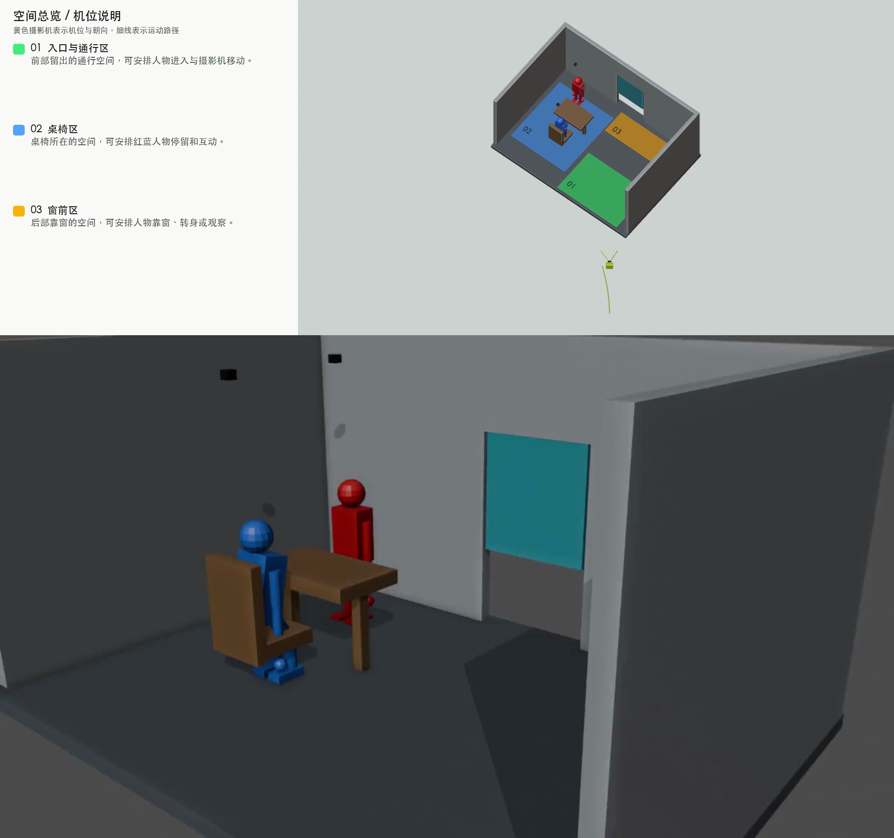

# Included examples / 公开案例

These two original examples ship with the repository and both platform bundles. Models are generated locally once by setup; no personal project library is distributed. Videos below are historical demonstrations, not a promise that every export uses the same camera or framing.

| Example | POV | Overview | Rebuildable scene |
| --- | --- | --- | --- |
| Room blocking / 室内排练 | [Video](room-pov.mp4) | [Video](room-overview.mp4) | `scripts/create_calibration_scene.py` (in installation ZIP) |
| Steamship / 蒸汽小船 | [Video](steamship-pov.mp4) | [Video](steamship-overview.mp4) | `scripts/create_steamship_scene.py` (in installation ZIP) |

## Room / 室内排练

Two color-coded characters move around a table and window. Practice editable blocking, camera recording, and switching between the POV and spatial view.

## Steamship / 蒸汽小船

A character runs from the cabin onto the deck and a fixed-wing aircraft passes overhead. The cabin and deck are separate colored spaces with dimensions and descriptions.

## Use the examples / 使用案例

Run the normal setup described in [English](../INSTALL.md) or [中文](../INSTALL.zh-CN.md). Setup creates `examples/calibration_scene.blend` and `examples/steamship_scene.blend`. Start the director desk and choose **室内排练** or **蒸汽小船** from Projects. Create a variation before editing if you want to keep the original model and keys.

在欢迎页描述你的空间、人物数量、动作和运镜，再让已连接的 Agent 执行该任务。也可直接选择现有案例，用手机 Safari 运镜并导出。视频是白模预演，不含模型生成后的最终美术效果。

The source, generated geometry and included example media are provided under the repository's [GPL-3.0 license](../LICENSE). See [export formats](../docs/export-formats.md) for current output dimensions and combined layouts.
